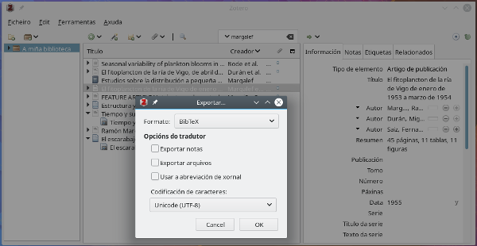

# Markdown

**[Markdown]((https://en.wikipedia.org/wiki/Markdown))** é unha lingua de marcado simple (_lightweight markup language_) que lle da formato aos documentos de texto plano. Isto é, unha convención para estruturar semanticamente documentos de texto plano. Esta linguaxe creouna John Gruber[^1] en 2004, colaborando con Aaron Swartz, coa intención de simplificar a escritura de documentos HTML. A súa finalidade sería a crear dun xeito sinxelo webs, e tamén textos ou notas, cunha linguaxe que fose sinxela pero que tivese un certo potencial para a edicións. A súa sintaxe está pensada para ser lexible e que non interrompa, isto é, que os seus ficheiros sexan faciles de ler. O uso desta linguaxe en páxinas como Reddit ou Github deulle creto desde o seu comezo e fíxerona popular.

A convección de Markdown ten algunhas variantes, ou *supersets*, deseñadas para contextos específicos, como blogues ou repositorios de código. Á sintaxe básica de Gruber engadíronselle compoñentes como táboas ou bloques de código. Aquí cabe mencionar as principais que son [CommonMark](http://commonmark.org/), [GitHub Flavored Markdown (GFM)](https://github.github.com/gfm/), [Markdown Extra](https://michelf.ca/projects/php-markdown/extra/) e [MultiMarkdown](http://fletcherpenney.net/multimarkdown/). Amais disto, existe unha adaptación de Markdown para [pandoc](https://pandoc.org/), que é un conversor universal de linguaxes de marcado. Pandoc precisa dun ficheiro [YAML](https://yaml.org/) xa que lle dá información cos seus metadatos, útil para as conversións de formatos.

Sobre do código que podemos incluír en Markdown, cabe citar que hai implementacións de linguaxes como [R](https://cran.r-project.org/), que se emprega en estatística e análise de datos, e que permiten xerar libros dixitais e dinámicos. Para o caso de R ese formato adaptado é [R Markdown](https://rmarkdown.rstudio.com/).

## Introdución a Markdown 

A edición en Markdown faise en textos planos aos que se lles dá a extensión _.md_ ou _.markdown_. Estes ficheiros en formato Markdown procésanse con intérpretes (ou _parsers_) que xeran documentos [HTML](https://www.w3.org/TR/html52/). Eses ficheiros HTML pódense procesar e converter en formatos como PDF ou epub. Isto é:

1. Edítanse documentos con extensión _.md_ ou _.markdown_ en editores de texto,
2. Ábrense e convértense eses ficheiros en documentos HTML usando editores de Markdown, e
3. Visualízanse en HTML no navegador web ou convértense noutros formatos como PDF.


### Editores de Markdown

Sendo Markdown dunha sintaxe simple, podemos facer edicións en case calquera editor de texto. De feito a idea xeral de Markdown é usar etiquetas fáciles de lembrar e editar.

Así que podemos editar nesta linguaxe no noso computador usando:
- [vim](http://www.vim.org/),
- [GNU Emacs](https://www.gnu.org/software/emacs/)
- [kate](https://kate-editor.org/)
- [gedit](https://wiki.gnome.org/Apps/Gedit)
- [atom](https://atom.io/)
- [Zettler](https://www.zettlr.com/)
- [ReText](https://github.com/retext-project/retext)
- ou [LibreOffice](https://gl.libreoffice.org/)

E tamén creándoos ou almacenándoos na nube e editándoos alí con editores en liña como:
- [CodiMD](https://demo.codimd.org/)
- [Dillinger](https://dillinger.io/)
- [hackmd.io](https://hackmd.io)
- [Markua](http://markuapad.com/)
- [MEditor](https://pandao.github.io/editor.md/en.html)
- [StackEdit](https://stackedit.io/)

Markdown está presente en plataformas como [Github](http://github.com/) e [Gitlab](https://gitlab.com/). Existen tamén plataformas colaborativas específicas para a edición de publicacións científicas que o implementaron, como [Authorea](https://www.authorea.com/).

### Sobre Markdown e HTML

Xa que Markdown pretende ter unha sintaxe sinxela e está deseñado para a escritura na web, non ten todas as carácterísticas que HTML ten. Markdown está pensado para substituír a un número pequeno de etiquetas HTML de todas as que existen. Porén, dentro de texto en Markdown pódense incluír sen problema bloques de HTML. As únicas restricións serán as dos elementos que determinan os bloques (como `<div>`, `<table>`, `<pre>` ou `<p>`).

O introducir código HTML en ficheiros en Markdown soe ser útil no caso das imaxes e ligazóns.

## Sintaxe

### Cabeceiros

Os títulos e cabeceiros dos documentos engádense empregando o símbolo (`#`) diante da frase.

| Markdown            		     | HTML                       |
|--------------------------------|----------------------------|
| `# Nivel de cabeceiro 1`       | `<h1>Nivel de cabeceiro 1</h1>` |
| `## Nivel de cabeceiro 2`      | `<h2>Nivel de cabeceiro 2</h2>` |
| `### Nivel de cabeceiro 3`     | `<h3>Nivel de cabeceiro 3</h3>` |
| `#### Nivel de cabeceiro 4`    | `<h4>Nivel de cabeceiro 4</h4>` |
| `##### Nivel de cabeceiro 5`   | `<h5>Nivel de cabeceiro 5</h5>` |

Tamén se poden editar incluíndo por debaixo das liñas de texto os carácteres `==` para o cabeceiro principal e `--` para o cabeceiro secundario. O número de elementos na liña, isto é `==` ou `=====`, non importa para a edición.

| Markdown                       | HTML                                   |
|--------------------------------|----------------------------------------|
| `Nivel de cabeceiro 1`         | `<h1>Nivel de cabeceiro 1</h1>`        |
| `====================`         |                                        |
|--------------------------------|----------------------------------------|
| `Nivel de cabeceiro 2`         | `<h2>Nivel de cabeceiro 2</h2>`        |
| `--------------------`         |                                        |

### Parágrafos

Para crear un parágrafo novo abonda con separar as liñas con unha ou máis liñas en branco. Esas liñas en branco non poden conter espazos ou tabulacións.

~~~~~~~
Velaquí o primeiro parágrafo.

E velaquí o segundo parágrafro.
~~~~~~~

~~~~~~~
<p>Velaquí o primeiro parágrafo.</p>

<p>E velaquí o segundo parágrafo.</p>
~~~~~~~

### Saltos de liña

Os saltos de liña, que en HTML son `<br>`, créanse engadindo un ou máis espazos ao final da liña.

~~~~~~~
Velaquí a primeira liña.   <!--- --->
E velaquí a segunda liña.   
~~~~~~~

~~~~~~~
<p>Velaquí a primeira liña.<br />
E velaquí a segunda liña.</p>
~~~~~~~

### Resaltado de texto

O texto pódese subliñar engadindo **grosas** ou *cursivas*.

O texto groso engádese con dous `**` ou dous `__`, facendo que o texto a subliñar quede entre estas etiquetas.

~~~~~~~
Destácase a frase **en grosa**.

Destácase a frase __en grosa__.
~~~~~~~

Que en HTML é:

~~~~~~~
Destácase a frase <strong>en grosa</strong>.
~~~~~~~

O texto en cursiva edítase do mesmo xeito só que cun só `*` ou `_` arredor do texto a subliñar.

~~~~~~~
Destácase a frase en *cursiva*.

Destácase a frase en _cursiva_.
~~~~~~~

Con isto no texto subliñaranse as palabras en **grosa** e *cursiva*.

No caso de querer subliñar unha frase con grosa e cursiva de par, destacándoo ***así***, empréganse tres `***` ou `___`.

### Mencións

Cando se quere facer unha mención, isto é, unha cita dunha frase ou algún outro elemento no texto emprégase un `>` diante do parágrafo.

~~~~~~~
> ... Entendo que os gran e determinantes e feitos da distribución xeográfica son explicables coa teoría da migración (polo xeral das formas de vida máis dominantes), xunto cos posteriores cambios e multiplicacións das novas formas. (*A orixe das especies*, Ch. Darwin)
~~~~~~~

~~~~~~~
<blockquote>
  <p>... Entendo que os gran e determinantes e feitos da distribución xeográfica son explicables coa teoría da migración (polo xeral das formas de vida máis dominantes), xunto cos posteriores cambios e multiplicacións das novas formas. (<i>A orixe das especies</i>, Ch. Darwin)</p>
</blockquote>
~~~~~~~

Iso no texto verase como:

> ... Entendo que os gran e determinantes e feitos da distribución xeográfica son explicables coa teoría da migración (polo xeral das formas de vida máis dominantes), xunto cos posteriores cambios e multiplicacións das novas formas. (*A orixe das especies*, Ch. Darwin)

### Listas

As listas poden ser de elementos nos que non importe a súa orde ou nos que si se marque unha orde.

Ás **listas ordenadas** créanse cos números seguidos dun punto (`.`). Inda que comecemos a lista cun número calquera, e mesmo desordenados, a lista sempre comezará polo número 1.

~~~~~~~
1. Primeiro elemento
2. Segundo elemento
3. Terceiro elemento

1. Primeiro elemento
1. Segundo elemento
1. Terceiro elemento
~~~~~~~

Visto en HTML  eses dous exemplos seguen este marcado:

~~~~~~~
<ol>
  <li>Primeiro elemento</li>
  <li>Segundo elemento</li>
  <li>Terceiro elemento</li>
</ol>
~~~~~~~

E no noso texto veranse así:

1. Primeiro elemento
2. Segundo elemento
3. Terceiro elemento

Do mesmo xeito, as **listas sen orde** créanse empregando calquera destes símbolos: guións (`-`), asteriscos (`*`) ou máis (`+`). Así:

~~~~~~~
- Primeiro elemento
- Segundo elemento
- Terceiro elemento
~~~~~~~

O cal en HTML terá unha expresión así:

~~~~~~~
<ul>
  <li>Primeiro elemento</li>
  <li>Segundo elemento</li>
  <li>Terceiro elemento</li>
</ul>
~~~~~~~

E como se dixo veranse así:

- Primeiro elemento
- Segundo elemento
- Terceiro elemento

Así mesmo, as listas pódense agrupar. Se se indenta un elemento premendo o tabulador ou con catro espazos créase unha lista dentro doutra lista.

~~~~~~~
1. Primeiro elemento
2. Segundo elemento
    1. Primeiro elemento indentado
    2. Segundo elemento indentado
3. Cuarto elemento
~~~~~~~

~~~~~~~
<ol>
  <li>Primeiro elemento</li>
  <li>Segundo elemento
  <ol>
  	 <li>Primeiro elemento indentado</li>
   <li>Segundo elemento indentado</li>
   </ol>
   </li>
  <li>Cuarto elemento</li>
</ol>
~~~~~~~

No documento verase así:

1. Primeiro elemento
2. Segundo elemento
    1. Primeiro elemento indentado
    2. Segundo elemento indentado
3. Cuarto elemento

As listas con orde e sen orde pódense mesturar, i.e, nun elemento dunha lista ordenada introducirmos unha lista sen orde.

#### Listas de definicións

Algúns editores de Markdown permiten crear listas de definicións, como pode ser o caso dun dicionario.

~~~~~~~
Evolución:
: O proceso de acumulación de cambios.
: (*bioloxía*) Os cambios na composición xénica dunha poboación co paso de múltiples xeracións.
~~~~~~~

~~~~~~~
<dl>
  <dt>Evolución:</dt>
  <dd>O proceso de acumulación de cambios.</dd>
  <dd>(<i>bioloxía</i>) Os cambios na composición xénica dunha poboación co paso de múltiples xeracións.</dd>
</dl>
~~~~~~~

E esa definición mostrarase así:

**Evolución**:
: O proceso de acumulación de cambios.
: (*bioloxía*) Os cambios na composición xénica dunha poboación co paso de múltiples xeracións.

### Ligazóns

As ligazóns créanse pechando o texto en corchetes (`[galipedia]`) seguido dunha URL dentro de parénteses (`(https://gl.wikipedia.org)`)

~~~~~~~
O ***[software libre](https://gl.wikipedia.org/wiki/Software_libre)*** é o software que se distribúe con condicións nas súas licenzas que garanten que calquera usuario, e para calquera fin, poida empregar, estudar, modificar e publicar o software con novas modificacións.
~~~~~~~

~~~~~~~
<p>O <strong><em><a href="https://gl.wikipedia.org/wiki/Software_libre">software libre</a></em></strong> é o software que se distribúe con condicións nas súas licenzas que garanten que calquera usuario, e para calquera fin, poida empregar, estudar, modificar e publicar o software con novas modificacións.</p>
~~~~~~~

Con iso '***[software libre](https://gl.wikipedia.org/wiki/Software_libre)***' móstrase coa súa ligazóns.

Ás ligazóns pódeselle engadir títulos, que se mostrarán ao pasar o cursor sobre do texto. Introdúcense deste xeito:

~~~~~~~
O ***[software libre](https://gl.wikipedia.org/wiki/Software_libre "O movemento do software aberto e libre!")*** é o software que se distribúe [...]
~~~~~~~

#### URLs e correos electrónicos

Pódense engadir con facilidade ligazóns a webs ou correos electrónicos acollendo o texto entre corchetes:

~~~~~~~
<https://trasno.gal>
<info@trasno.gal>
~~~~~~~

~~~~~~~
<a href="https://trasno.gal">https://trasno.gal</a>
<a href="mailto:info@trasno.gal">info@trasno.gal</a>
~~~~~~~

### Imaxes

As imaxes engádense empregando ``. Entre os `[]` inclúese a descrición da imaxe e entre os `()` o cartafol que contén a imaxe, ou ULR a esta. Despois do `!` veñen os corchetes que levan o atributo `alt` de texto para esa imaxe. Entre os parénteses, `()`, indícase o cartafol onde se atopa a imaxe, que pode estar en local ou na web.

~~~~~~

~~~~~~

Markdown non acepta carácterísticas propias para indicar as dimensións da imaxe. Mais, as imaxes pódense introducir directamente coas etiquetas HTML:

~~~~~~

~~~~~~

### Código fonte

Cando se quere mostrar código en liña dunha linguaxe de programación empréganse a caixa ``código``. A sintaxe do código resaltarase. Como exemplo:

~~~~~~~
O cartafol de traballo obtense empregando `getwd()`.
~~~~~~~

~~~~~~~
O cartafol de traballo obtense empregando <code>getwd()</code>.
~~~~~~~

Iso visualízase deste xeito:

> O cartafol de traballo obtense empregando `getwd()`.

Pódende abrir esas caixas de código indicando a linguaxe da que se trata. Existen implementacións para bash, C, [Julia](https://julialang.org/), [Python](https://www.python.org/), [R](https://cran.r-project.org/) ou [SQL](https://gl.wikipedia.org/wiki/SQL) entre outras[^2]. Uns exemplos son:

~~~~~
```{r}
x <- 1/log(pi)
```
~~~~~

~~~~~
```{python}
y = y/9
print(y)
```
~~~~~

### Escape de formato

Cando se editan listas con elementos variados ou se introduce código, hai veces nas se necesita omitir algún carácter que si emprega Markdown para algunha finalidade. Nesta linguaxe o elemento que nos permite saltar un carácter concreto e que daría unha orde é o `\`, que ten que ir por diante do carácter a omitir.

Como exemplo:

~~~~~~~
\* Sen a barra inversa estariamos a introducir unha lista
E sen a barra inversa teríamos unha palabra en \*cursiva\*.
~~~~~~~

Os carácteres que se precisa obviar son os seguintes:

| carácter          | Nome                  |
|-------------------|-----------------------|
| `\`               | barra invertida       |
| `` ` ``           | comiña                |
| `*`               | asterisco             |
| `_`               | barra baixa           |
| `{}`              | corchete              |
| `[]`              | corchete              |
| `()`              | paréntese             |
| `#`               | cancelo               |
| `+`               | máis                  |
| `-`               | menos/guión           |
| `.`               | punto                 |
| `!`               | exclamación           |

### Estrutura de bloques

Pódense crear liñas horizontais e crear bloques de texto empregando de tres en tres os seguintes símbolos por debaixo do bloque de texto: asteriscos (`***`), guións (`---`), ou barras baixas (`___`). Estes forman a etiqueta dan á etiqueta HTML de `<hr />`.

## Táboas

As táboas créansen empregando máis de tres guións a cada cabeceiro separadas por barras verticais (`|`). O primeiro define a columna e o segundo define onde separar as columnas continuas. Aínda que o número de guións ou o espazado que lle deamos ás columnas sexa diferente, estas veranse iguais.

~~~~~~~
| Sintaxe     | Descrición  |
| ----------- | ----------- |
| Cabeceiro   | Título      |
| Parágrafo   | Texto       |
~~~~~~~
~~~~~~~
| Sintaxe | Descrición |
| ----------- | ----------- |
| Cabeceiro | Título |
| Parágrafo | Texto |
~~~~~~~

~~~~~~~
<table>
  <thead>
    <tr class="header">
      <th>Sintaxe</th>
      <th>Descrición</th>
    </tr>
  </thead>
  <tbody>
    <tr class="odd">
      <td>Cabeceiro</td>
      <td>Título</td>
    </tr>
    <tr class="even">
      <td>Parágrafo</td>
      <td>Texto</td>
    </tr>
  </tbody>
</table>
~~~~~~~

Esa táboa mostrarase así:

| Sintaxe     | Descrición  |
| ----------- | ----------- |
| Cabeceiro   | Título      |
| Parágrafo   | Texto       |

O formato das táboas pode levar cursivas ou grosas, ligazóns e código, mais só código en liña (dentro dun `` ` ``). Os bloques de código non os aceptan as táboas.

A unha columna pódeselle dar un aliñamento do texto que contén deixando un `:` á dereita ou esquerda, ou nos dous lados, de varios `-`. Un exemplo sería:

~~~~~~~
| Especie     | Clase       | Familia       |
| :---        |    :----:   |          ---: |
| Chaetoceros_laciniosus  | Bacillariophyceae | Chaetocerotaceae  |
| Dinophysis acuta        | Dinoflagellata    |  Dinophysis       |
~~~~~~~

Que se verá deste deito:

| Especie     | Clase       | Familia     |
| :---        |    :----:   |          ---: |
| Chaetoceros_laciniosus  | Bacillariophyceae | Chaetocerotaceae  |
| Dinophysis acuta  |  Dinoflagellata |  Dinophysis |

Crear táboas soe ser complexo pero existen ferramentas para converter e crear táboas en liña. En [Tables Generator](http://www.tablesgenerator.com/markdown_tables) pódense converter táboas entre os formatos de LaTeX, Wikidata e Markdown.

## Notas de rodapé

Nalgúns editores, cando se escribe pódense engadir notas de rodapé coa súa ligazón nun punto concreto do texto. Esas notas engadidas estarán ligadas coa palabra que se queira e amosaranse cunha ligazón que dirixe á nota.

Para crealas abonda con engadir un identificador único dentro de corchetes (`[^a]`). Os identificadores teñen que ser únicos e poden ser unha palabra ou número sen espazos ou tabuladores. Ao final do texto estas notas de rodapé veranse en orde segundo se citasen.

~~~~~~~
> *Hai unha grandeza nesta visión da vida que, coas súas diferentes forzas, se orixinou nunhas poucas formas ou nunha soa; e que, mentres este planeta estivo orbitando seguindo a constante lei da gravidade, a partir dun tan simple inicio as formas máis belas e máis marabillosas foron, e están, evolucionando.*[^H1859]

[^1]: Charles Darwin, 1859.
~~~~~~~

## Identificadores de seccións

Moitos dos editores de Markdown aceptan que se lle dea un identificador a cada seccións dos nosos documentos. Estes introdúcense seguindo ao texto co cabeceiro tal que: [cabeceiro](#identificador). Con estes cabeceiros podemos crear ligazóns internas no texto para citar calquera apartado. A cita á sección faise empregando [texto a ligar](#identificador)

## Markdown e YAML

Nos cabeceiros dos ficheiros de Markdown pódense introducir metainformación que nos permita definir certos valores útiles. Esa información introdúcese coa sintaxe de [YAML](https://yaml.org/) (*YAML Ain’t Markup Language*), un estándar sinxelo de metainformación para todas as linguaxes de programación.

As variables que se introduzan nun bloque YAML nun ficheiro `.md` vainas empregar `pandoc` no seu traballo de conversión.

O formato YAML consiste nun bloque entre guións, `(---)`, e que contén como mínimo esta información:

~~~~~~~
---
 title: Isto é o título
 author: Autores/as
 date: 27/4/2019
---
~~~~~~~

Nese ficheiro é onde se poden indicar datos de saída dos documentos Markdown. Un caso é indicarlle que a conversión se faga a HTML empregando o estilo que contén un ficheiro CSS:

~~~~~~~
---
 title: Isto é o título
 author: Autores/as
 date: 27/4/2019
 html_document:
   css: estilos.css
---
~~~~~~~

Esta información do ficheiro YAML emprégana algúns editores ou IDEs como RStudio, caso do formato R Markdown (`.Rmd`).

# Pandoc e Markdown

## Pandoc

[Pandoc](https://pandoc.org/) é un conversor universal de formatos. Como din no proxecto, é unha *navalla-suíza* para automatizar a conversión entre ducias de formatos. Ten implementadas linguaxes de marcado como Markdown, LaTeX, marcado wikicomo MediaWiki ou DokuWiki, PDF e formato de documentos como ODT ou OpenDocument XML.

A dinámica esencial de `pandoc` é indicar:

> pandoc -o saida.ficheiro entrada.ficheiro

Onde `-o` indica cal debe ser o formato de saída do ficheiro que queremos converter. No caso de que indiquemos múltiples ficheiros, pandoc vainos concatenar no documento final de saída.

No caso dos ficheiros PDF, o conversor `pandoc` segue este proceso de conversión:

> Markdown -> LaTeX -> Formatos de referencias bibliográficas -> PDF

## Conversión de Markdown

Empregando `pandoc` podemos converter os ficheiros `.md` en case calquera formato.

Así, para converter un `.md` en formato HTML5:

> pandoc -f markdown -t html5 -o saida.html entrada.md -c estilo.css

Para converter un `.md` en ficheiro de texto `.odt`, editable en LibreOffice:

> pandoc -s saida.odt -t markdown -o entrada.md

E se se quere crear un ficheiro PDF precisaremos de ter instalado e configurado LaTeX no equipo. O proceso de conversión neste caso é:

> pandoc entrada.md -s -o saida.pdf

# Usando bibliografías

O uso de referencias bibliográficas é algo común en moitos campos, como no sector académico. As citas académicas soen incluírse nos textos cun estilo concreto, estándarizado.

Polo xeral sóense empregar xestores de bibliografía para almacenar as referencias de interese. Unha das mellores opcións, e de software libre, é [Zotero](https://www.zotero.org/). Con aplicativos como Zotero pódense xestionar coleccións de referencias e exportar a ficheiros de bibliografía, *i.e.* como o formato BibTeX (`.bib`). 



Nese formato gárdanse as citas deste xeito:

~~~~~
@article{margalef_fitoplancton_1955,
	title = {El fitoplancton de la ría de {Vigo} de enero de 1953 a marzo de 1954},
	issn = {0020-9953},
	url = {http://digital.csic.es/handle/10261/87372},
	abstract = {45 páginas, 11 tablas, 11 figuras},
	language = {spa},
	urldate = {2015-09-29},
	author = {Margalef, Ramón and Durán, Miguel and Saiz, Fernando},
	year = {1955}
}
~~~~~

Cada cita ten o seu identificador único, que no caso do exemplo anterior é `margalef_fitoplancton_1955`. Ese identificador pódense empregar na escritura engadíndolle un `@`, isto é `@margalef_fitoplancton_1955`.

Unha vez teñamos o texto coas referencias incluídas (`@id`) e o ficheiro `.bib` que as conteña, pódesenlle indicar a `pandoc` onde se ubica:

~~~~~~~
---
 title: Isto é o título
 author: Autores/as
 date: 27/4/2019
 bibliography: biblioteca.bib
---
~~~~~~~

Para procesar as referencias bibliográficas `pandoc` precisa da instalación de `pandoc-citeproc`. Con ese engadido, cando se faga a chamada a `pandoc`, este buscará o ficheiro que conteña as referencias e procesaraas no texto. Para iso faise a chamada incluíndo a `pandoc-citeproc`:

> pandoc -S -o texto.odt --filter pandoc-citeproc texto.md

# Editando libros e outros tipos de formatos {#libros}

Arestora hai elaboradoros diferentes recursos para traballar no noso computador e crear libros ou guías baseados, en boa parte, en Markdown. Nalgún caso empregan os recursos de `pandoc`. Unhas suxestións para editar no noso computador libros ou documentos avanzados son as seguintes:

* [Pandoc Book Template](https://github.com/wikiti/pandoc-book-template): un modelo esencial para a escritura de libros electrónicos (*ebooks*).

* [Wordsmith](https://github.com/amedrz/wordsmith): un modelo que fai uso de Ruby que permite crear e publicar libros electrónicos, guías ou manuais.

* [PhD thesis in Markdown](https://github.com/tompollard/phd_thesis_markdown): un modelo en Markdown con algunha parte en LaTeX pensado para a escritura de teses doutorais e libros similares en estrutura.

Para aqueles que queiran crear libros e documentos dinámicos onde os gráficos xoguen un papel relevante, existe [bookdown](https://bookdown.org/yihui/bookdown/). Como se indicara, `bookdown` é un paquete para a linguaxe de programación R que permite crear documentos HMTL, PDF ou epub en `R Markdown`. Este recurso permite incluír gráficos dinámicos e aplicacións coas que interaccionar e acepta o uso doutras linguaxes como C/C++, Python, Julia ou SQL. Os libros creados nesta libraría de R pódense publicar de xeito automático na web [bookdown.org](https://bookdown.org).

Do mesmo xeito, [GitBook](https://www.gitbook.com/) é un servizo que permite publicar desde Git e GitHub libros creados con Markdown.

Ademais, os editores en liña de Markdown dispoñen de modelos ou outros recursos interesantes para crear diferentes tipos de documentación.

Os seguintes editores en liña de Markdown permiten ademais:
- [hackmd.io/](https://hackmd.io/): crear modelos de presentacións orais e libros.
- [http://markua.com/](http://markuapad.com/): crear libros.

# Resumo

## Sintaxe básica

A sintaxe que definiou J. Gruber é a seguinte:

| Elemento          | Sintaxe Markdown                                     |
|-------------------|------------------------------------------------------|
| Cabeceiro         | `# H1`                                               |
|                   | `## H2`                                              |
|                   | `### H3`                                             |
|-------------------|------------------------------------------------------|
| Grosa             | `**texto groso**`                                    |
|-------------------|------------------------------------------------------|
| Cursiva           | `*texto en cursiva*`                                 |
|-------------------|------------------------------------------------------|
| Cita              |  `> cita`                                            |
|-------------------|------------------------------------------------------|
| Lista ordenada    | `1. Primeiro elemento`                               |
|                   | `2. Segundo elemento`                                |
|                   | `3. Terceiro elemento`                               |
|-------------------|------------------------------------------------------|
| Lista sen orde    | `- Primeiro elemento`                                |
|                   | `- Segundo elemento`                                 |
|                   | `- Terceiro elemento`                                |
|-------------------|------------------------------------------------------|
| Código            | `` `código` ``                                       |
|-------------------|------------------------------------------------------|
| Liñas horizontais |  `---`                                               |
|-------------------|------------------------------------------------------|
| Ligazóns          |  `[título](https://www.paxina.gal)`                  |
|-------------------|------------------------------------------------------|
| Imaxes            |  ``                            |


## Sintaxe avanzada

Á sintaxe básica engadíronselle elementos como os seguintes:

| Elemento          | Sintaxe Markdown                                     |
|-------------------|------------------------------------------------------|
| Táboa             | \`\|\` para columnas                                    |
|                   | \`---\` para filas`                                    |
|-------------------|------------------------------------------------------|
| Bloques de código | \`\`\`                                     |
|                   | \`{                                                 |
|                   |    x = pi                                            |
|                   |    print(x)                                          |
|                   |                                                      |
|                   | }\`                                                |
|                   | \`\`\`                                   |
|-------------------|------------------------------------------------------|
| [Rodapé](#rodape) | `Texto onde se inclúe unha nota. [^1]`               |
|                   |                                                      |
|                   | `[^1]: Esta é a nota de rodapé.`                     |
|-------------------|------------------------------------------------------|
| ID de cabeceiro   | `### Sección {#id-sección}`                          |
|-------------------|------------------------------------------------------|
| Definicións       | `termo`                                              |
|                   | `: definición`                                       |


# Notas

[1]: Web persoal de John Gruber <http://daringfireball.net/>

[2]: A lista completa de linguaxes implementadas pódese atopar aquí: [Yihui: Language engines](https://bookdown.org/yihui/rmarkdown/language-engines.html)

# Bibliografía

- Dennis Tenen and Grant Wythoff (2014) *Sustainable Authorship in Plain Text using Pandoc and Markdown," The Programming Historian 3*. <https://programminghistorian.org/en/lessons/sustainable-authorship-in-plain-text-using-pandoc-and-markdown>

- Matt Cone (2018) *The comprehensive Markdown reference guide*. <https://www.markdownguide.org/book>

- Yihui Xie, J. J. Allaire and Garrett Grolemund (2019) *R Markdown: The Definitive Guide*. <https://bookdown.org/yihui/rmarkdown/>

# Recursos

* A *documentación oficial* de John Gruber de Markdown: [A guía oficial feita polo creador de Markdown]( https://daringfireball.net/projects/markdown/)

* [Markdown Tutorial](https://www.markdowntutorial.com/): Unha páxina web de código aberto que permite probar Markdown desde o navegador.

* *Awesome Markdown*: A list of Markdown tools and learning resources. <https://github.com/mundimark/awesome-markdown>

* RMarkdown de RStudio: *Pandoc Markdown* <https://rmarkdown.rstudio.com/authoring_pandoc_markdown.html>

* *Jekyll*, un xerador de webs estáticas baseado en ficheiros Markdown. <https://jekyllrb.com/>

# Licenza

Este documento ten unha licenza **Attribution-ShareAlike 4.0 International (CC BY-SA 4.0)**. Os fundamentos desta obra baséanse no traballo de M. Cone, e que está liberado coa esta mesma licenza (a CC BY-SA 4.0). As condicións da licenza pódense ler en [creativecommons.org/licenses](https://creativecommons.org/licenses/by-sa/4.0/)
